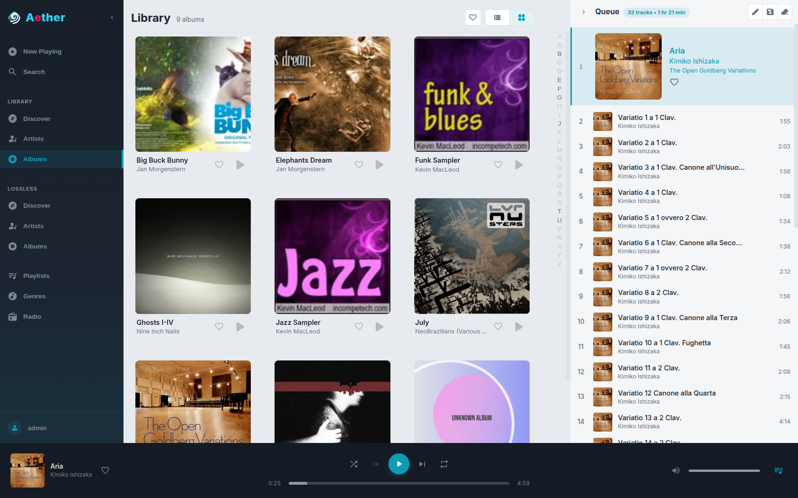

# Aether

Aether is a self-hosted music server that indexes your music folders and streams
them over an OpenSubsonic-compatible API. It ships as a single Go binary with the
Vue 3 web player embedded.

> **Pre-release:** under active development.
> [More details](https://andresbott.github.io/aether/docs/about/pre-release/)



**Documentation:** <https://andresbott.github.io/aether/>

## Quick start with Docker

```sh
docker run -d --name aether -p 8075:8075 \
  -e AETHER_AUTH_ADMINBOOTSTRAP_PW='change-me' \
  -v aether-data:/var/lib/aether \
  -v /path/to/music:/music:ro \
  ghcr.io/andresbott/aether:latest
```

Open <http://localhost:8075>, sign in as `admin` with the password above, and
run a scan under **Settings → Tasks**.

For the Debian package, the plain binary and the container's options, see
[Installation](https://andresbott.github.io/aether/docs/getting-started/installation/).

## Development

See [DEVELOPMENT.md](DEVELOPMENT.md).
